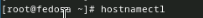
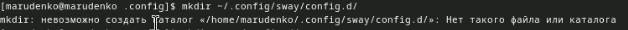

---
## Front matter
title: "Лабораторная работа 1"
subtitle: "Установка федоры"
author: "Михаил Андреевич Руденко"

## Generic otions
lang: ru-RU
toc-title: "Содержание"

## Bibliography
bibliography: bib/cite.bib
csl: pandoc/csl/gost-r-7-0-5-2008-numeric.csl

## Pdf output format
toc: true # Table of contents
toc-depth: 2
lof: true # List of figures
lot: true # List of tables
fontsize: 12pt
linestretch: 1.5
papersize: a4
documentclass: scrreprt
## I18n polyglossia
polyglossia-lang:
  name: russian
  options:
	- spelling=modern
	- babelshorthands=true
polyglossia-otherlangs:
  name: english
## I18n babel
babel-lang: russian
babel-otherlangs: english
## Fonts
mainfont: PT Serif
romanfont: PT Serif
sansfont: PT Sans
monofont: PT Mono
mainfontoptions: Ligatures=TeX
romanfontoptions: Ligatures=TeX
sansfontoptions: Ligatures=TeX,Scale=MatchLowercase
monofontoptions: Scale=MatchLowercase,Scale=0.9
## Biblatex
biblatex: true
biblio-style: "gost-numeric"
biblatexoptions:
  - parentracker=true
  - backend=biber
  - hyperref=auto
  - language=auto
  - autolang=other*
  - citestyle=gost-numeric
## Pandoc-crossref LaTeX customization
figureTitle: "Рис."
tableTitle: "Таблица"
listingTitle: "Листинг"
lofTitle: "Список иллюстраций"
lotTitle: "Список таблиц"
lolTitle: "Листинги"
## Misc options
indent: true
header-includes:
  - \usepackage{indentfirst}
  - \usepackage{float} # keep figures where there are in the text
  - \floatplacement{figure}{H} # keep figures where there are in the text
---

# Цель работы

Цель работы

Целью данной работы является приобретение практических навыков установки операционной системы на виртуальную машину, настройки минимально необходимых для дальнейшей работы сервисов.

# Задание

Дождитесь загрузки графического окружения и откройте терминал. В окне терминала проанализируйте последовательность загрузки системы, выполнив команду dmesg. Можно просто просмотреть вывод этой команды:

dmesg \| less

Можно использовать поиск с помощью grep:

dmesg \| grep -i "то, что ищем"

Получите следующую информацию.
Версия ядра Linux (Linux version).
Частота процессора (Detected Mhz processor).
Модель процессора (CPU0).
Объём доступной оперативной памяти (Memory available).
Тип обнаруженного гипервизора (Hypervisor detected).
Тип файловой системы корневого раздела.
Последовательность монтирования файловых систем.

# Теоретическое введение

Указания к работе

# Техническое обеспечение

Лабораторная работа подразумевает установку на виртуальную машину VirtualBox (https:\/\/www.virtualbox.org\/) операционной системы Linux (дистрибутив Fedora).
Выполнение работы возможно как в дисплейном классе факультета физико-математических и естественных наук РУДН, так и дома. Описание выполнения работы приведено для дисплейного класса со следующими характеристиками техники:
Intel Core i3-550 3.2 GHz, 4 GB оперативной памяти, 80 GB свободного места на жёстком диске;
ОС Linux Gentoo (http:\/\/www.gentoo.ru\/);
VirtualBox версии 7.0 или новее.
Для установки в виртуальную машину используется дистрибутив Linux Fedora (https://getfedora.org), вариант с менеджером окон sway (https:\/\/fedoraproject.org\/spins\/sway\/).
При выполнении лабораторной работы на своей технике вам необходимо скачать необходимый образ операционной системы (https://fedoraproject.org/spins/sway/download/index.html).
В дисплейных классах можно воспользоваться образом в каталоге /afs/dk.sci.pfu.edu.ru/common/files/iso.

# Соглашения об именовании

При выполнении работ следует придерживаться следующих правил именования:
Пользователь внутри виртуальной машины должен иметь имя, совпадающее с учётной записью студента, выполняющего лабораторную работу.
Имя хоста вашей виртуальной машины должно совпадать с учётной записью студента, выполняющего лабораторную работу.
Имя виртуальной машины должно совпадать с учётной записью студента, выполняющего лабораторную работу.

В дисплейных классах вы можете посмотреть имя вашей учётной записи, набрав в терминале команду:

id -un

При установке на своей технике необходимо использовать имя вашей учётной записи дисплейных классов. Например, если студента зовут Остап Сулейманович Бендер, то его учётная запись имеет вид osbender.

Последовательность выполнения работы

# Выполнение в дисплейном классе

Загрузите в дисплейном классе операционную систему Linux. Осуществите вход в систему.

## Настройка каталога для виртуальных машин

Создание необходимых каталогов

Запустите терминал. Перейдите в каталог /var/tmp:

cd \/var\/tmp

Создайте каталог с именем пользователя (совпадающий с логином студента в дисплейном классе). Для этого можно использовать команду:

mkdir \/var\/tmp\/`id -un`

Проверьте в свойствах VirtualBox месторасположение каталога для виртуальных машин:

\/var\/tmp\/имя_пользователя

Здесь имя_пользователя — логин (учётная запись) студента в дисплейном классе. Если указан другой каталог, то требуется изменить его.

Папка виртуальных машин

Значения по умолчанию
Linux: \$HOME\/VirtualBox VMs.

Графический интерфейс
В меню выберите Файл, Настройки.
Выберите Общие, поле Папка для машин по умолчанию.
Установите новое значение, например \/var\/tmp\/имя_пользователя.
Нажмите ОК, чтобы сохранить изменения.

Командная строка
Зададим отображение информации о настройках VirtualBox на английском.

Поэтому следует задать кодировку для отображения свойств VirtualBox:

vboxmanage setproperty language C

Установим папку для виртуальных машине в \/var\/tmp\/имя_пользователя:

vboxmanage setproperty machinefolder \/var\/tmp\/$(id -un)

Поверьте, что папка виртуальных машин по умолчанию изменена:

vboxmanage list systemproperties \| grep "Default machine folder:"

Следующая команда выдаст только каталог:

vboxmanage list systemproperties \| grep "Default machine folder:\" \| cut -d\"\:\" -f2 \| tr -d \' \'

Установочный образ

Перенесите установочный образ в папку /var/tmp/имя_пользователя/iso:

mkdir -p \"\$(vboxmanage list systemproperties \| grep \'Default machine folder\:\' \| cut -d\'\:\' -f2 \| tr -d \' \')\/iso"
mv Fedora-Sway-Live-x86_64-39-1.5.iso "$(vboxmanage list systemproperties | grep 'Default machine folder\:\' \| cut -d\'\:\' -f2 \| tr -d \' \')\/iso"

## Настройка хост-клавиши

Хост-клавишей по умолчанию является правый Ctrl.
По умолчанию в дисплейных классах на клавише правый Ctrl находится переключатель языка ввода.
Эти значения могут конфликтовать.

Графический интерфейс
В меню выберите Файл, Настройки.
Выберите Ввод, вкладка Виртуальная машина.
Выберите Сочетание клавиш в строке Хост-комбинация.
Нажмите новое сочетание клавиш.
Нажмите ОК, чтобы сохранить изменения.

Командная строка

Проверьте текущую комбинацию для хост-клавиши:

VBoxManage getextradata global GUI\/Input\/HostKeyCombination

По умолчанию установлена комбинация 65508, соответствующая правой клавише Ctrl.

Установите нужную клавишу (в примере клавиша Menu):

VBoxManage setextradata global GUI\/Input\/HostKeyCombination 65383

Комбинации клавиш можно, например, посмотреть на странице https\:\/\/pythonhosted.org\/pyglet\/api\/pyglet\.window\.key-module\.html\.

# Создание виртуальной машины

Для использования графического интерфейса запустите менеджер виртуальных машин, введя в командной строке:

VirtualBox \&

Создайте новую виртуальную машину в графическом интерфейсе или в командной строке\.

В командной строке\:

vboxmanage createvm \-\-name \"\$(id -un)_os\-intro\" \-\-ostype Fedora_64 \-\-register

Укажите имя виртуальной машины (ваш логин в дисплейном классе), тип операционной системы \— Linux, Fedora.

Укажите размер основной памяти виртуальной машины \— от 2048 МБ.

В командной строке\:

vboxmanage modifyvm \"\$(id \-un)_os\-intro\" \-\-memory 2048 \-\-acpi on \-\-nic1 nat

Задайте конфигурацию жёсткого диска \— загрузочный, VDI (VirtualBox Disk Image), динамический виртуальный диск.

Задайте размер диска \— 80 ГБ (или больше), его расположение \— в данном случае \/var\/tmp\/имя_пользователя\/имя_машины\/имя_машины.vdi.

В командной строке\:

vboxmanage createhd \-\-filename \"\$(vboxmanage list systemproperties \| grep \'Default machine folder\:\' \| cut \-d\'\:\' \-f2 \| tr \-d \' \')\/\$(id \-un)_os\-intro\/\$(id \-un)_os\-intro.vdi\" \-\-size 80000

Выберите в VirtualBox Вашей виртуальной машины. Добавьте новый привод оптических дисков и выберите образ.

В командной строке\:

Подключите загрузку с DVD\:

vboxmanage modifyvm \"\$(id \-un)_os\-intro\" \-\-boot1 dvd

Добавьте IDE-контроллер\:

vboxmanage storagectl \"\$(id \-un)_os\-intro\" \-\-name \"IDE Controller\" \-\-add ide \-\-controller PIIX4

Установите созданный вами файл VDI в качестве первого виртуального жесткого диска новой виртуальной машины\:

vboxmanage storageattach \"\$(id \-un)_os\-intro\" \-\-storagectl \"IDE Controller\" \-\-port 0 \-\-device 0 \-\-type hdd \-\-medium \"\$(vboxmanage list systemproperties \| grep \'Default machine folder\:\' \| cut \-d\'\:\' \-f2 \| tr \-d \' \')\/\$(id \-un)_os\-intro\/\$(id \-un)_os\-intro.vdi\"

Подключите к виртуальной машине ISO-файл\:

vboxmanage storageattach \"\$(id \-un)_os\-intro\" \-\-storagectl \"IDE Controller\" \-\-port 0 \-\-device 1 \-\-type dvddrive \-\-medium \"\$(vboxmanage list systemproperties \| grep \'Default machine folder\:\' \| cut \-d\'\:\' \-f2 \| tr \-d \' \')\/iso\/Fedora\-Sway\-Live\-x86_64\-39\-1.5.iso\"

При установке на собственной технике используйте скачанный образ операционной системы Fedora.

В качестве графического контроллера поставьте VMSVGA.

В командной строке\:

vboxmanage modifyvm \"\$(id \-un)\_os\-intro\" \-\-graphicscontroller\=vmsvga

Включите ускорение 3D\.

В командной строке\:

vboxmanage modifyvm \"\$(id \-un)\_os\-intro\" \-\-accelerate\-3d\=on

Если есть проблемы при отображении, загрузитесь в режиме базовой графики.

Включите общий буфер обмена и перетаскивание объектов между хостом и гостевой ОС.

В командной строке\:

vboxmanage modifyvm \"\$(id \-un)\_os\-intro" \-\-clipboard\-mode\=bidirectional \-\-drag\-and\-drop\=bidirectional

Включите поддержку UEFI.

В командной строке:

vboxmanage modifyvm \"\$(id \-un)_os\-intro\" \-\-firmware\=efi

Видео\: Создание виртуальной машины

RuTube\: Создание виртуальной машины

Youtube\: Создание виртуальной машины

Установка операционной системы

## Запуск приложения для установки системы

Загрузите LiveCD.
Появится интерфейс начальной конфигурации.
Hажмите Enter для создания конфигурации по умолчанию.
Нажмите Enter, чтобы выбрать в качестве модификатора клавишу Win (она же клавиша Super).
В файле конфигурации эта клавиша будет обозначена как $Mod.
Нажмите комбинацию Win\+Enter для запуска терминала.
В терминале запустите liveinst.
Для перехода к раскладке окон с табами нажмите Win\+w.

## Установка системы на диск

Выберите язык интерфейса и перейдите к настройкам установки операционной системы.
При необходимости скорректируйте часовой пояс, раскладку клавиатуры (рекомендуется в качестве языка по умолчанию указать английский язык).
Место установки ОС оставьте без изменения.
Установите имя и пароль для пользователя root.
Установите имя и пароль для Вашего пользователя.
Задайте сетевое имя Вашего компьютера.
После завершения установки операционной системы корректно перезапустите виртуальную машину.
В VirtualBox оптический диск должен отключиться автоматически, но если это не произошло, то необходимо отключить носитель информации с образом.

Видео\: Установка операционной системы

RuTube\: Установка операционной системы

Youtube\: Установка операционной системы

## После установки

Войдите в ОС под заданной вами при установке учётной записью\.
Нажмите комбинацию Win\+Enter для запуска терминала\.

Переключитесь на роль супер\-пользователя\:

sudo \-i

## Обновления

Обновить все пакеты

dnf \-y update

## Повышение комфорта работы

Программы для удобства работы в консоли\:

dnf \-y install tmux mc

## Автоматическое обновление

При необходимости можно использовать автоматическое обновление\.

Установка программного обеспечения\:

dnf install dnf\-automatic

Задаёте необходимую конфигурацию в файле \/etc\/dnf\/automatic\.conf\.

Запустите таймер\:

systemctl enable \-\-now dnf\-automatic\.timer

Отключение SELinux

В данном курсе мы не будем рассматривать работу с системой безопасности SELinux\.
Поэтому отключим его\.

В файле \/etc\/selinux\/config замените значение

SELINUX\=enforcing

на значение

SELINUX\=permissive

Перегрузите виртуальную машину\:

reboot

## Установка драйверов для VirtualBox

Войдите в ОС под заданной вами при установке учётной записью\.
Нажмите комбинацию Win+Enter для запуска терминала\.

Запустите терминальный мультиплексор tmux\:

tmux

Переключитесь на роль супер-пользователя\:

sudo \-i

Установите средства разработки\:

dnf \-y group install \"Development Tools\"

Установите пакет DKMS:

dnf \-y install dkms

В меню виртуальной машины подключите образ диска дополнений гостевой ОС\.

Подмонтируйте диск:

mount \/dev\/sr0 \/media

Установите драйвера\:

\/media\/VBoxLinuxAdditions\.run

Перегрузите виртуальную машину:

reboot

## Настройка раскладки клавиатуры

Войдите в ОС под заданной вами при установке учётной записью\.
Нажмите комбинацию Win+Enter для запуска терминала\.

Запустите терминальный мультиплексор tmux\:

tmux

Создайте конфигурационный файл \~\/\.config\/sway\/config\.d\/95\-system\-keyboard\-config\.conf\:

touch \~\/\.config\/sway\/config\.d\/95\-system\-keyboard\-config\.conf

Отредактируйте конфигурационный файл \~\/\.config\/sway\/config\.d\/95\-system\-keyboard\-config\.conf\:

exec_always \/usr\/libexec\/sway\-systemd\/locale1\-xkb\-config \-\-oneshot

Переключитесь на роль супер-пользователя:

sudo \-i

Отредактируйте конфигурационный файл \/etc\/X11\/xorg\.conf\.d\/00\-keyboard\.conf\:

Section \"InputClass\"
Identifier \"system\-keyboard\"
MatchIsKeyboard \"on\"
Option \"XkbLayout\" \"us,ru\"
Option \"XkbVariant\" \",winkeys\"
Option \"XkbOptions\" \"grp\:rctrl_toggle,compose\:ralt,terminate\:ctrl_alt_bksp\"
EndSection

Для этого можно использовать файловый менеджер mc и его встроенный редактор\.

Перегрузите виртуальную машину\:

reboot

Видео\: Настройка раскладки клавиатуры

RuTube\: Настройка раскладки клавиатуры

Youtube\: Настройка раскладки клавиатуры

Установка имени пользователя и названия хоста

Если при установке виртуальной машины вы задали имя пользователя или имя хоста, не удовлетворяющее соглашению об именовании, то вам необходимо исправить это\.
Запустите виртуальную машину и залогиньтесь\.
Нажмите комбинацию Win+Enter для запуска терминала\.

Запустите терминальный мультиплексор tmux\:

tmux

Переключитесь на роль супер-пользователя\:

sudo \-i

Создайте пользователя (вместо username укажите ваш логин в дисплейном классе)\:

adduser \-G wheel username

Задайте пароль для пользователя (вместо username укажите ваш логин в дисплейном классе)\:

passwd username

Установите имя хоста (вместо username укажите ваш логин в дисплейном классе)\:

hostnamectl set-hostname username

Проверьте, что имя хоста установлено верно:

hostnamectl

Видео: Имя пользователя и хоста

RuTube: Имя пользователя и хоста

Youtube: Имя пользователя и хоста

Подключение общей папки

Внутри виртуальной машины добавьте своего пользователя в группу vboxsf (вместо username укажите ваш логин)\:

gpasswd -a username vboxsf

В хостовой системе подключите разделяемую папку:

vboxmanage sharedfolder add \"\$(id \-un)_os\-intro\" \-\-name\=work \-\-hostpath\=work \-\-automount

Перегрузите виртуальную машину:

reboot

Папка будет монтироваться в /media/sf_work.

Установка программного обеспечения для создания документации

Нажмите комбинацию Win+Enter для запуска терминала.

Запустите терминальный мультиплексор tmux:

tmux

Переключитесь на роль супер-пользователя\:

sudo \-i

Работа с языком разметки Markdown

Средство pandoc для работы с языком разметки Markdown.

Установка с помощью менеджера пакетов\:

dnf \-y install pandoc

Для работы с перекрёстными ссылками мы используем пакет pandoc\-crossref\.
Пакет pandoc-crossref в стандартном репозитории отсутствует\.
Придётся ставить вручную, скачав с сайта https:\/\/github\.com\/lierdakil\/pandoc-crossref\.
При установке pandoc-crossref следует обращать внимание, для какой версии pandoc он скомпилён.
Лучше установить pandoc и pandoc-crossref вручную\.
Скачайте необходимую версию pandoc-crossref (https\:\/\/github.com\/lierdakil\/pandoc-crossref\/releases).
Посмотрите, для какой версии откомпилён pandoc-crossref.
Скачайте соответствующую версию pandoc (https\:\/\/github\.com\/jgm\/pandoc\/releases)\.
Распакуйте архивы.
Обе программы собраны в виде статически-линкованных бинарных файлов.
Поместите их в каталог \/usr\/local\/bin\.

texlive

Установим дистрибутив TeXlive:

dnf \-y install texlive\-scheme\-full

Видео: Установка TeX

RuTube: Установка TeX

Youtube: Установка TeX

# Выполнение лабораторной работы

Описываются проведённые действия, в качестве иллюстрации даётся ссылка на иллюстрацию (рис. [-@fig:001]).

{#fig:001 width=70%}

{#fig:002 width=70%}

{#fig:004 width=70%}

{#fig:005 width=70%}

{#fig:006 width=70%}

{#fig:007 width=70%}

{#fig:008 width=70%}

{#fig:009 width=70%}

{#fig:0010 width=70%}

{#fig:003 width=70%}

{#fig:0011 width=70%}

{#fig:0012 width=70%}

{#fig:0013 width=70%}

{#fig:0014 width=70%}

{#fig:0015 width=70%}

{#fig:0016 width=70%}

{#fig:0017 width=70%}

{#fig:0018 width=70%}

{#fig:0019 width=70%}

{#fig:0021 width=70%}

{#fig:0022 width=70%}

{#fig:0022 width=70%}

{#fig:0023 width=70%}

{#fig:0024 width=70%}

{#fig:0025 width=70%}

{#fig:0026 width=70%}

{#fig:0027 width=70%}

{#fig:0028 width=70%}

{#fig:0029 width=70%}

{#fig:0030 width=70%}

{#fig:0031 width=70%}

{#fig:0032 width=70%}

{#fig:0033 width=70%}

{#fig:0034 width=70%}

{#fig:0035 width=70%}

{#fig:0036 width=70%}

{#fig:0037 width=70%}

{#fig:0038 width=70%}

{#fig:0039 width=70%}

{#fig:0040 width=70%}

{#fig:0041 width=70%}

{#fig:0042 width=70%}

{#fig:0043 width=70%}

# Выводы

Здесь кратко описываются итоги проделанной работы.

