---
## Front matter
title: "Отчёт по лабораторной работе 6"
subtitle: "Поиск файлов. Перенаправление ввода-вывода. Просмотр запущенных процессов"
author: "Руденко Михаил Андреевич"

## Generic otions
lang: ru-RU
toc-title: "Содержание"

## Bibliography
bibliography: bib/cite.bib
csl: pandoc/csl/gost-r-7-0-5-2008-numeric.csl

## Pdf output format
toc: true # Table of contents
toc-depth: 2
lof: true # List of figures
lot: true # List of tables
fontsize: 12pt
linestretch: 1.5
papersize: a4
documentclass: scrreprt
## I18n polyglossia
polyglossia-lang:
  name: russian
  options:
	- spelling=modern
	- babelshorthands=true
polyglossia-otherlangs:
  name: english
## I18n babel
babel-lang: russian
babel-otherlangs: english
## Fonts
mainfont: PT Serif
romanfont: PT Serif
sansfont: PT Sans
monofont: PT Mono
mainfontoptions: Ligatures=TeX
romanfontoptions: Ligatures=TeX
sansfontoptions: Ligatures=TeX,Scale=MatchLowercase
monofontoptions: Scale=MatchLowercase,Scale=0.9
## Biblatex
biblatex: true
biblio-style: "gost-numeric"
biblatexoptions:
  - parentracker=true
  - backend=biber
  - hyperref=auto
  - language=auto
  - autolang=other*
  - citestyle=gost-numeric
## Pandoc-crossref LaTeX customization
figureTitle: "Рис."
tableTitle: "Таблица"
listingTitle: "Листинг"
lofTitle: "Список иллюстраций"
lotTitle: "Список таблиц"
lolTitle: "Листинги"
## Misc options
indent: true
header-includes:
  - \usepackage{indentfirst}
  - \usepackage{float} # keep figures where there are in the text
  - \floatplacement{figure}{H} # keep figures where there are in the text
---

# Цель работы

Ознакомление с инструментами поиска файлов и фильтрации текстовых данных.
Приобретение практических навыков: по управлению процессами (и заданиями), по
проверке использования диска и обслуживанию файловых систем.

# Задание

1. Осуществите вход в систему, используя соответствующее имя пользователя.
2. Запишите в файл file.txt названия файлов, содержащихся в каталоге /etc. Допи-
шите в этот же файл названия файлов, содержащихся в вашем домашнем каталоге.
3. Выведите имена всех файлов из file.txt, имеющих расширение .conf, после чего
запишите их в новый текстовой файл conf.txt.
Кулябов Д. С. и др. Операционные системы 59
4. Определите, какие файлы в вашем домашнем каталоге имеют имена, начинавшиеся
с символа c? Предложите несколько вариантов, как это сделать.
5. Выведите на экран (по странично) имена файлов из каталога /etc, начинающиеся
с символа h.
6. Запустите в фоновом режиме процесс, который будет записывать в файл ~/logfile
файлы, имена которых начинаются с log.
7. Удалите файл ~/logfile.
8. Запустите из консоли в фоновом режиме редактор gedit.
9. Определите идентификатор процесса gedit, используя команду ps, конвейер и фильтр
grep. Как ещё можно определить идентификатор процесса?
10. Прочтите справку (man) команды kill, после чего используйте её для завершения
процесса gedit.
11. Выполните команды df и du, предварительно получив более подробную информацию
об этих командах, с помощью команды man.
12. Воспользовавшись справкой команды find, выведите имена всех директорий, имею-
щихся в вашем домашнем каталоге.

# Теоретическое введение

6.2.1. Перенаправление ввода-вывода
В системе по умолчанию открыто три специальных потока:
– stdin — стандартный поток ввода (по умолчанию: клавиатура), файловый дескриптор
0;
– stdout — стандартный поток вывода (по умолчанию: консоль), файловый дескриптор
1;
– stderr — стандартный поток вывод сообщений об ошибках (по умолчанию: консоль),
файловый дескриптор 2.
Большинство используемых в консоли команд и программ записывают результаты
своей работы в стандартный поток вывода stdout. Например, команда ls выводит в стан-
дартный поток вывода (консоль) список файлов в текущей директории. Потоки вывода
и ввода можно перенаправлять на другие файлы или устройства. Проще всего это делается
с помощью символов >, >>, <, <<. Рассмотрим пример.
1 # Перенаправление stdout (вывода) в файл.
2 # Если файл отсутствовал, то он создаётся,
3 # иначе -- перезаписывается.
4
5 # Создаёт файл, содержащий список дерева каталогов.
6 ls -lR > dir-tree.list
7
8 1>filename
9 # Перенаправление вывода (stdout) в файл "filename".
10 1>>filename
11 # Перенаправление вывода (stdout) в файл "filename",
12 # файл открывается в режиме добавления.
13 2>filename
14 # Перенаправление stderr в файл "filename".
15 2>>filename
16 # Перенаправление stderr в файл "filename",
17 # файл открывается в режиме добавления.
18 &>filename
19 # Перенаправление stdout и stderr в файл "filename".
56 Лабораторная работа № 6. Поиск файлов. Перенаправление ввода-вывода. Просмотр …
6.2.2. Конвейер
Конвейер (pipe) служит для объединения простых команд или утилит в цепочки, в ко-
торых результат работы предыдущей команды передаётся последующей. Синтаксис
следующий:
1 команда 1 | команда 2
2 # означает, что вывод команды 1 передастся на ввод команде 2
Конвейеры можно группировать в цепочки и выводить с помощью перенаправления
в файл, например:
1 ls -la |sort > sortilg_list
вывод команды ls -la передаётся команде сортировки sort\verb, которая пишет ре-
зультат в файл sorting_list\verb.
Чаще всего скрипты на Bash используются в качестве автоматизации каких-то рутин-
ных операций в консоли, отсюда иногда возникает необходимость в обработке stdout
одной команды и передача на stdin другой команде, при этом результат выполнения
команды должен обработан.
6.2.3. Поиск файла
Команда find используется для поиска и отображения на экран имён файлов, соответ-
ствующих заданной строке символов.
Формат команды:
1 find путь [-опции]
Путь определяет каталог, начиная с которого по всем подкаталогам будет вестись
поиск.
Примеры:
1. Вывести на экран имена файлов из вашего домашнего каталога и его подкаталогов,
начинающихся на f:
1 find ~ -name "f*" -print
Здесь ~ — обозначение вашего домашнего каталога, -name — после этой опции указы-
вается имя файла, который нужно найти, "f*" — строка символов, определяющая имя
файла, -print — опция, задающая вывод результатов поиска на экран.
2. Вывести на экран имена файлов в каталоге /etc, начинающихся с символа p:
1 find /etc -name "p*" -print
3. Найти в Вашем домашнем каталоге файлы, имена которых заканчиваются символом
~ и удалить их:
1 find ~ -name "*~" -exec rm "{}" \;
Здесь опция -exec rm "{}" \; задаёт применение команды rm ко всем файлам, име-
на которых соответствуют указанной после опции -name строке символов.
Для просмотра опций команды find воспользуйтесь командой man.
Кулябов Д. С. и др. Операционные системы 57
6.2.4. Фильтрация текста
Найти в текстовом файле указанную строку символов позволяет команда grep.
Формат команды:
1 grep строка имя_файла
Кроме того, команда grep способна обрабатывать стандартный вывод других команд
(любой текст). Для этого следует использовать конвейер, связав вывод команды с вводом
grep.
Примеры:
1. Показать строки во всех файлах в вашем домашнем каталоге с именами, начинающи-
мися на f, в которых есть слово begin:
1 grep begin f*
2. Найти в текущем каталоге все файлы, содержащих в имени «лаб»:
1 ls -l | grep лаб
6.2.5. Проверка использования диска
Команда df показывает размер каждого смонтированного раздела диска.
Формат команды:
1 df [-опции] [файловая_система]
Пример:
1 df -vi
Команда du показывает число килобайт, используемое каждым файлом или каталогом.
Формат команды:
1 du [-опции] [имя_файла...]
Пример.
1 du -a ~/
На afs можно посмотреть использованное пространство командой
1 fs quota
58 Лабораторная работа № 6. Поиск файлов. Перенаправление ввода-вывода. Просмотр …
6.2.6. Управление задачами
Любую выполняющуюся в консоли команду или внешнюю программу можно запустить
в фоновом режиме. Для этого следует в конце имени команды указать знак амперсанда
&. Например:
1 gedit &
Будет запущен текстовой редактор gedit в фоновом режиме. Консоль при этом не будет
заблокирована.
Запущенные фоном программы называются задачами (jobs). Ими можно управлять
с помощью команды jobs, которая выводит список запущенных в данный момент задач.
Для завершения задачи необходимо выполнить команду
1 kill %номер задачи
6.2.7. Управление процессами
Любой команде, выполняемой в системе, присваивается идентификатор процесса
(process ID). Получить информацию о процессе и управлять им, пользуясь идентифи-
катором процесса, можно из любого окна командного интерпретатора.
6.2.8. Получение информации о процессах
Команда ps используется для получения информации о процессах.
Формат команды:
1 ps [-опции]
Для получения информации о процессах, управляемых вами и запущенных (работаю-
щих или остановленных) на вашем терминале, используйте опцию aux.
Пример:
1 ps aux
Для запуска команды в фоновом режиме необходимо в конце командной строки ука-
зать знак & (амперсанд).
Пример работы, требующей много машинного времени для выполнения, и которую
целесообразно запустить в фоновом режиме:
1 find /var/log -name "*.log" -print > l.log &

# Выполнение лабораторной работы

Описываются проведённые действия, в качестве иллюстрации даётся ссылка на иллюстрацию (рис. [-@fig:001]).

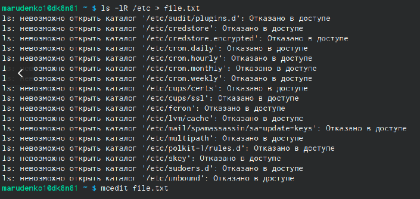{#fig:001 width=70%}

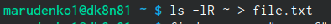{#fig:002 width=70%}

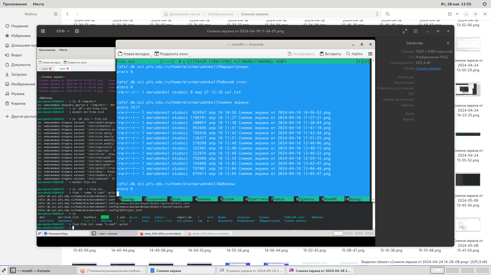{#fig:003 width=70%}

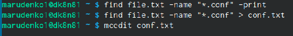{#fig:004 width=70%}

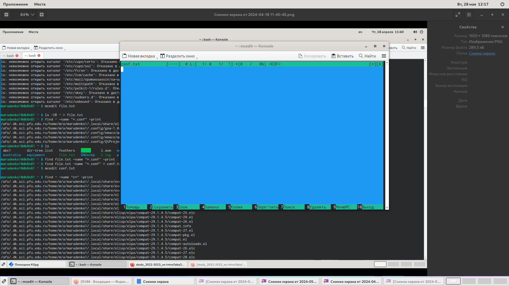{#fig:005 width=70%}

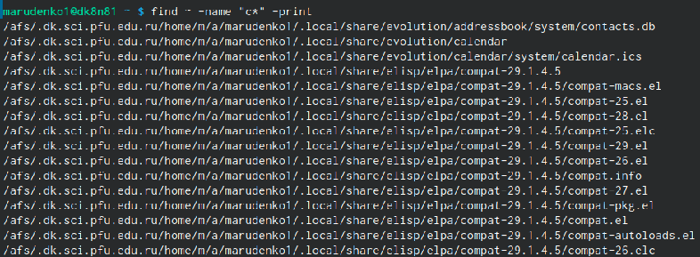{#fig:006 width=70%}

{#fig:007 width=70%}

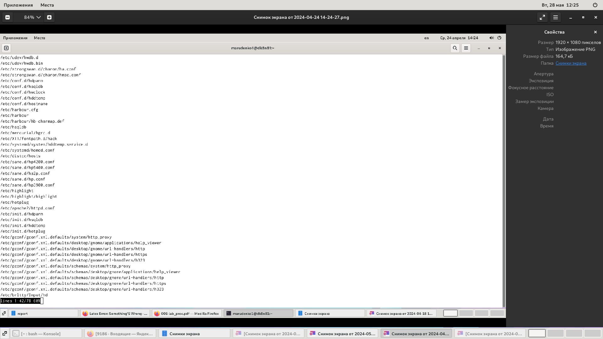{#fig:008 width=70%}

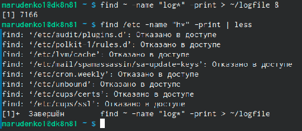{#fig:009 width=70%}

{#fig:0010 width=70%}

{#fig:0011 width=70%}

{#fig:0012 width=70%}

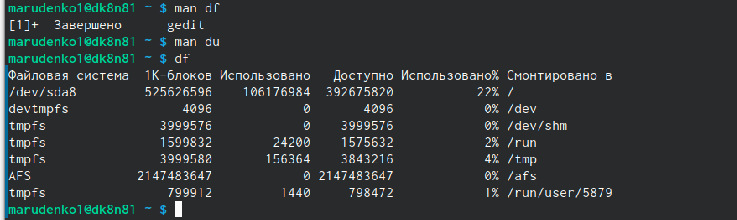{#fig:0013 width=70%}

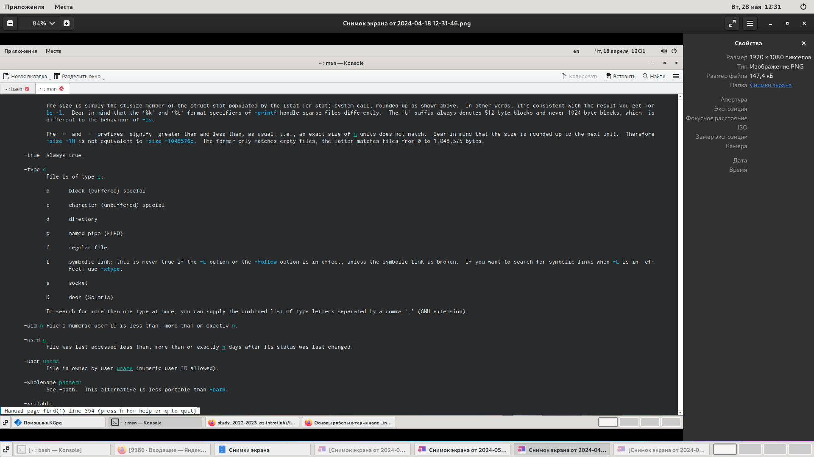{#fig:0014 width=70%}

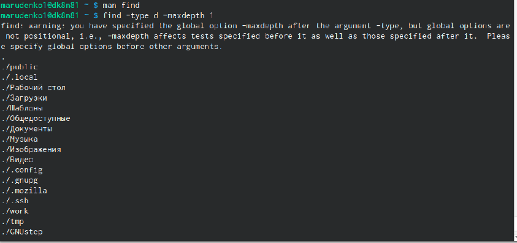{#fig:0015 width=70%}

# Выводы

Здесь кратко описываются итоги проделанной работы.

